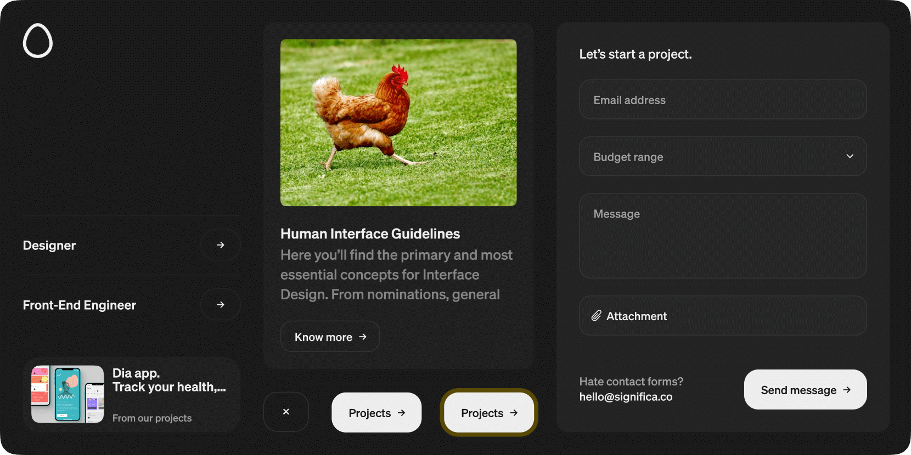

# Significa Svelte UI

This project is responsible for Significa's Svelte UI library.
Storybook preview available at [svelte-ui.significa.co](https://svelte-ui.significa.co).

This package is published as `@significa/significa-svelte-ui` in the
[NPM official registry](https://www.npmjs.com/package/@significa/svelte-ui) and
[GitHub package registry](https://github.com/significa/significa-svelte-ui/pkgs/npm/svelte-ui).

[](https://svelte-ui.significa.co)

## Using the package

### Installation

`npm install --save @significa/svelte-ui`

If you are using the GitHub package registry you might need to authenticate with the registry, see
[working with the npm registry](https://docs.github.com/en/packages/working-with-a-github-packages-registry/working-with-the-npm-registry)
for more information.

### Configuring tailwind

In your tailwind configuration file (`tailwind.config.cjs`), import our tailwind preset and update
the `content` key to include our package. Optionally (but ideally), you can include our brand fonts
by providing a path to your project's static font files.

```js
/** @type {import('tailwindcss').Config} */
module.exports = {
  content: [
    './src/**/*.{html,js,svelte,ts}',
    './node_modules/@significa/svelte-ui/**/*.{html,js,svelte,ts}' // add this
  ],
  presets: [
    require('@significa/svelte-ui/tailwind-preset') // add this
  ],
  theme: {
    // your theme
  }
};
```

### Including fonts (optional)

If the project needs to include our brand fonts, you can call the preset defining custom fonts and
their path:

```js
module.exports = {
  presets: [
    require('@significa/svelte-ui/tailwind-preset')({
      fonts: {
        sans: {
          name: 'Significa Sans',
          fontFaces: [
            {
              fontWeight: '400',
              src: `url('/fonts/significa-regular.woff2') format('woff2')`,
              ascentOverride: '95%'
            },
            {
              fontWeight: '500',
              src: `url('/fonts/significa-medium.woff2') format('woff2')`,
              ascentOverride: '95%'
            },
            {
              fontWeight: '600',
              src: `url('/fonts/significa-semibold.woff2') format('woff2')`,
              ascentOverride: '95%'
            }
          ]
        }
      }
    })
  ]
};
```

## Development

1. Ensure you are using a compatible node version (see [.nvmrc](./.nvmrc)
   and [`node_versions` in `ci-cd.yaml`](./.github/workflows/ci-cd.yaml)).
2. Install the dependencies with `npm install`.
3. Start Storybook's component preview server with `npm run storybook`.
   Access it at `http://localhost:6006/`.

### Releasing new versions

Just create a new [release](https://github.com/significa/significa-svelte-ui/releases) with a semver
compliant name, prefixed by `v`. Ex: `v1.2.3`, `v1.2.3-sample`.
